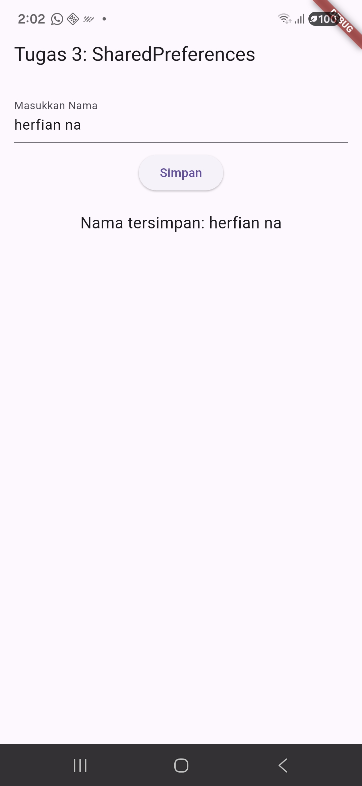

<<<<<<< HEAD
# Tugas 3: Penyimpanan Data Lokal

## Identitas

- Nama: Herfian Nurandriansyah
- NIM: 412311007
- Prodi: Sistem Informasi

## Deskripsi

Aplikasi Flutter sederhana untuk menyimpan nama user ke local storage menggunakan SharedPreferences.  
Data tetap tersimpan meskipun aplikasi ditutup atau di-restart.

## Langkah Implementasi

1. Tambahkan dependency `shared_preferences` di pubspec.yaml.
2. Buat `main.dart` dengan TextField, tombol Simpan, dan fungsi `_saveName()` serta `_loadName()`.
3. Jalankan aplikasi di HP dengan USB Debugging.

## Hasil Tampilan

## Kode Utama

Lihat file `lib/main.dart` untuk implementasi lengkap.
=======
# tugas3-penyimpanan-lokal
Flutter project Tugas 3 - SharedPreferences
>>>>>>> 9a9335dbb21b7c90b3af4d2b035633900819fcce
